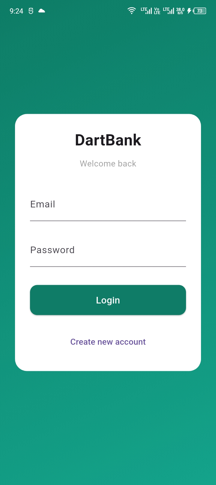
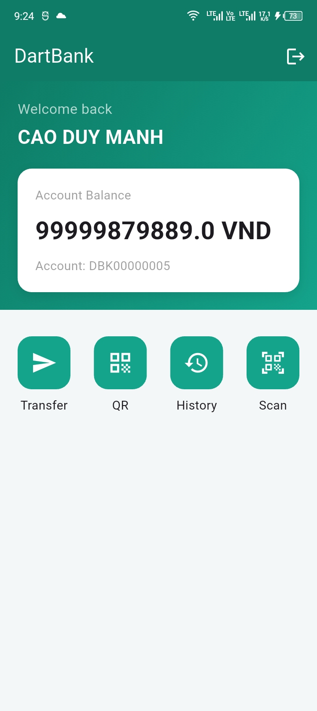
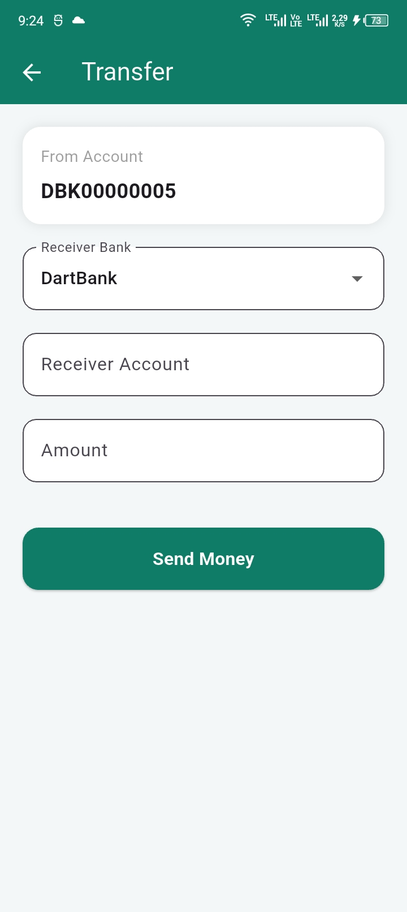
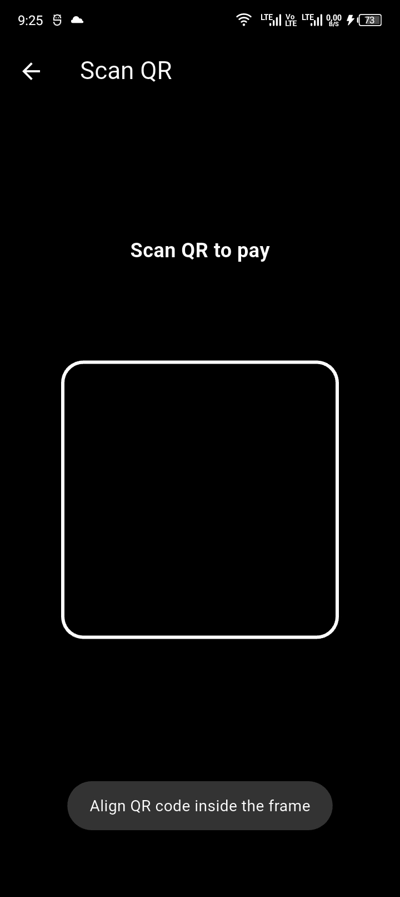
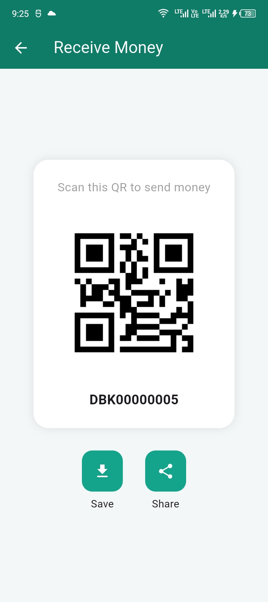
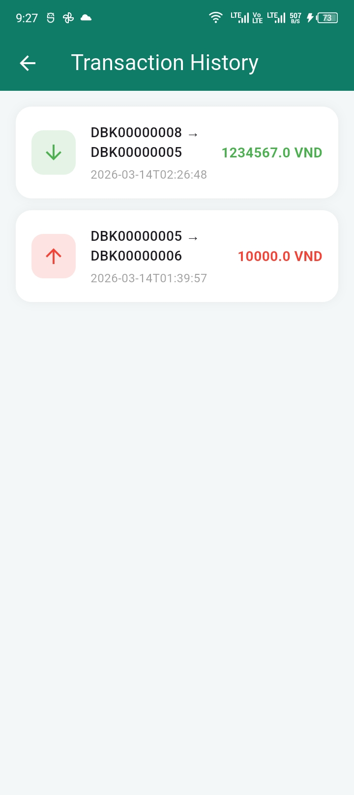

# DartBank Mobile Banking Demo

A simple **mobile banking demo application** built with **Flutter** and **FastAPI**.
The system simulates a digital banking environment with features such as account management, money transfer, QR payment, and interbank transactions.

This project is designed for learning and demonstration purposes.

---
# Images

<<<<<<< HEAD

# Features

=======
### Login


### Home


### Transfer


### QR Scan


### QR code


### History


# Features

>>>>>>> 0207857 (3rd commit)
### Authentication

* User registration
* User login with JWT authentication

### Account

* View account information
* View balance
* Account QR code generation

### Transfer

* Internal transfer (within the same bank)
* Interbank transfer (between DartBank and KTBank)

### QR Payment

* Generate QR code for receiving money
* Scan QR code to auto-fill receiver account
* Cross-bank QR transfer support

### Transaction History

* View transaction records
* Track incoming and outgoing transfers

---

# System Architecture

Mobile App (Flutter) -> DartBank Backend (FastAPI) -> Interbank Switch Service -> KTBank Backend

---

# Tech Stack

## Frontend

* Flutter
* Dart
* mobile_scanner (QR scanning)
* HTTP API integration

## Backend

* FastAPI
* Python
* MySQL
* JWT Authentication
* RESTful API

---

# Installation

## Backend

Create virtual environment

```
python -m venv venv
```

Activate virtual environment

```
source venv/bin/activate
```

Install dependencies

```
pip install -r requirements.txt
```

Run FastAPI server

```
uvicorn app.main:app --reload
```

Server runs at:

```
http://localhost:8000
```

---

## Mobile App

Install Flutter dependencies

```
flutter pub get
```

Run application

```
flutter run
```

Make sure the API base URL in `api_service.dart` matches your backend address.

---

# API Example

Transfer request example

```
POST /transfer
```

Request body

```
{
  "from_account": "DBK00000001",
  "to_bank": "KTB",
  "to_account": "KTB00000002",
  "amount": 500000
}
```

---

# Demo Flow

1. User logs into the mobile app
2. View account balance on the dashboard
3. Transfer money to another account
4. Scan QR code to auto-fill transfer information
5. Execute internal or interbank transfer

---

# Disclaimer

This project is a **demo banking system for educational purposes only**.
It does not represent a real financial system and should not be used in production environments.

---

# Author

Created by **Mạnh**
Information Technology Student
